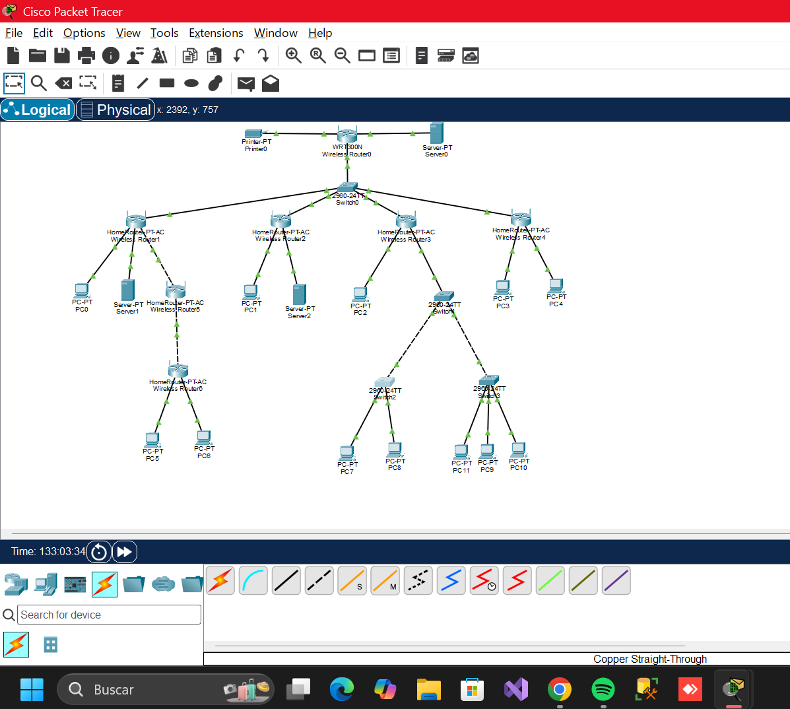
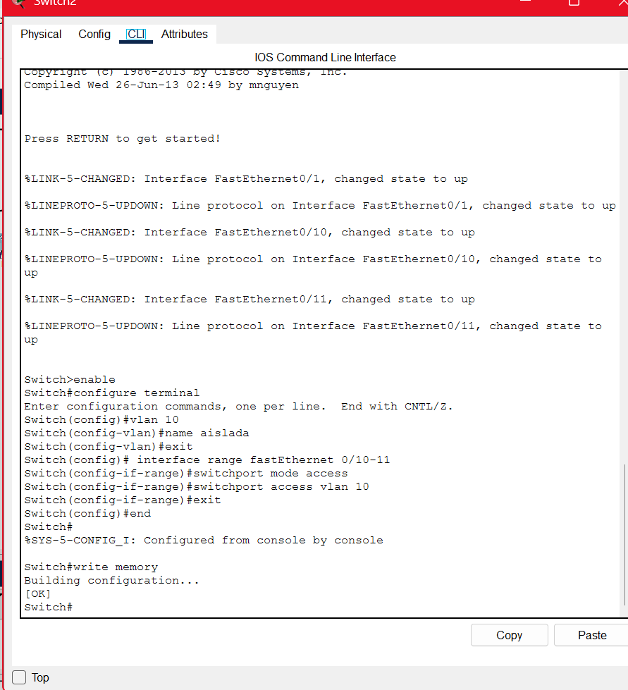
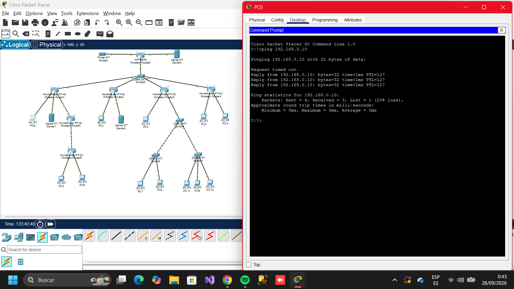
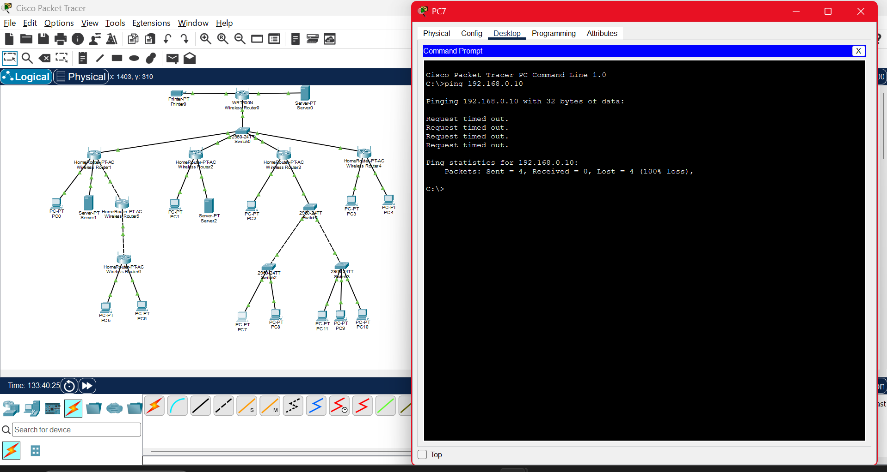
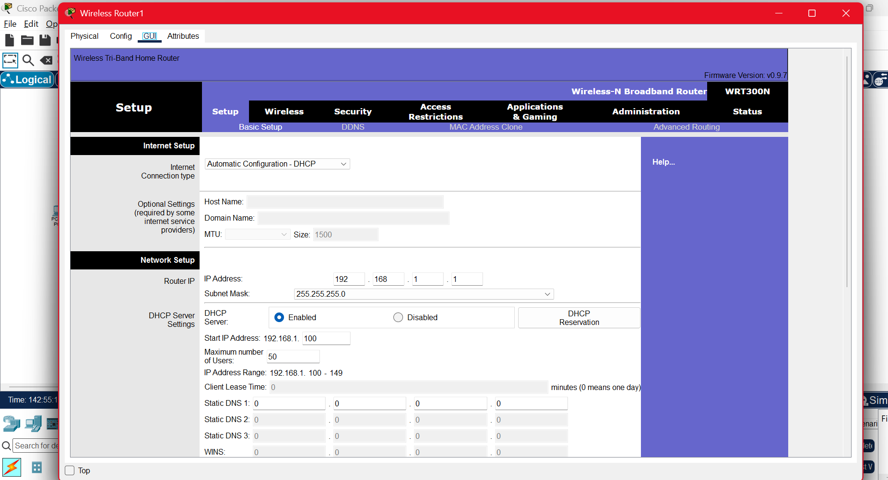
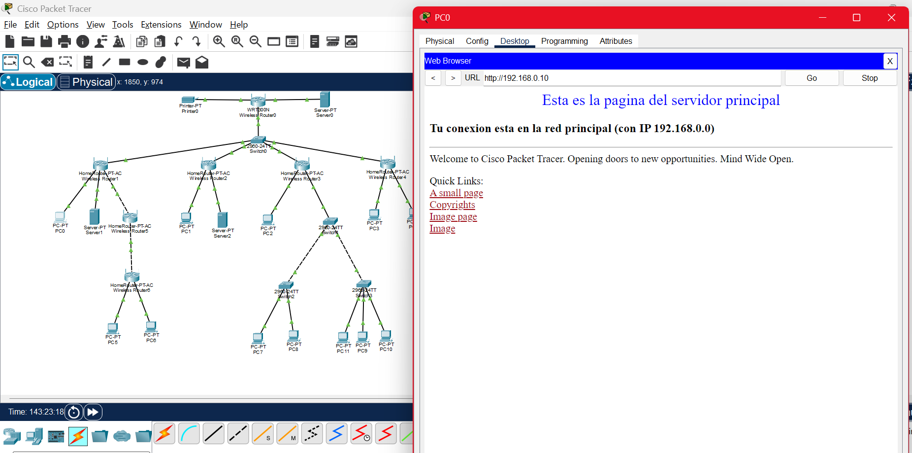
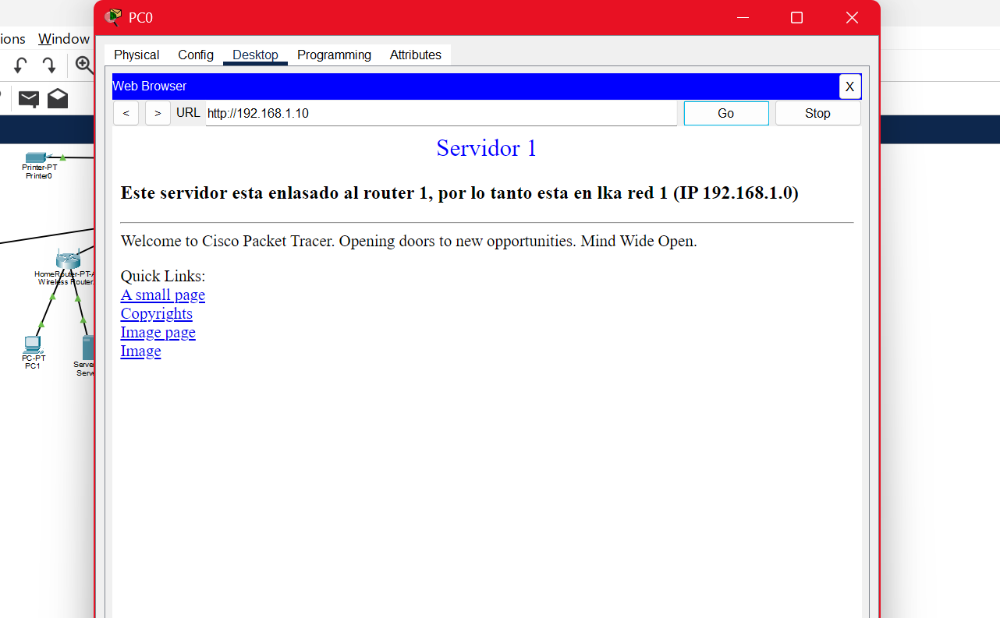
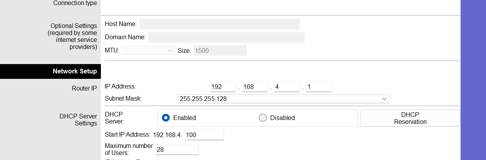
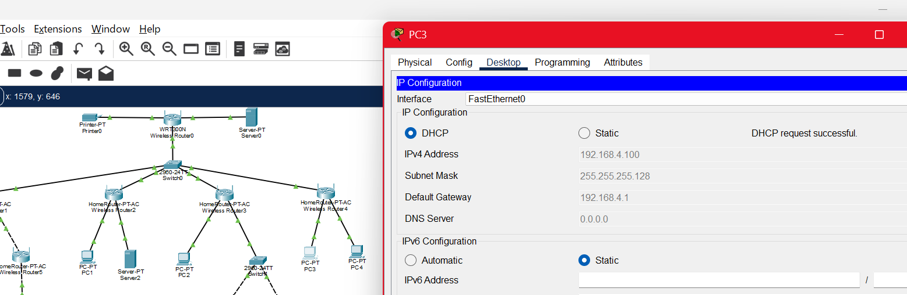

# Examen Unidad 1
# <h3>Por: Ivan Maldonado Carrizosa Docente: Jose Arturo Bustamante Lazcano     Conmutacion y enrutamiento</h3>
# DESCRIPCION
# <H3>CONEXION DE TOPOLOGIA</H3>
En este primer apartado hacemos la colocacion de cada uno de nuestros equipos (routers, switches, computadoras, servidores, e impresora)
Se puede notar que entre diferentes dispositivos se ocupan cables directos, y cuando son quipos similares, es decir un switch con un switch, o router con router se conecta con calble cross-over 

# <h3>Esta captura es la creacion de nuestra VLAN</h3>

# 2.1Configuracion de IP en routers y equipos de computo
Haciendo pruebas de ping desde la terminal, de un equipo de computo a llegar a el router principal

Haciendo una segunda prueba la cual es de los equipos que estan en la VLAN y sepuede observar que se han aislado de manera correcta

# 2.2 Trafico de red
Especificacion del DHCP y GATEWAY en los routers

# 2.3 Paginas web y ubicacion de red
Identificacion de la pagina web del servidor principal

Pagina web del servidor 1

# Cambio de mascara de red

verificacion del cambio de la mascara de red

# Archivo ZIP
[Examen.zip](conmutacion/exmn.zip)
